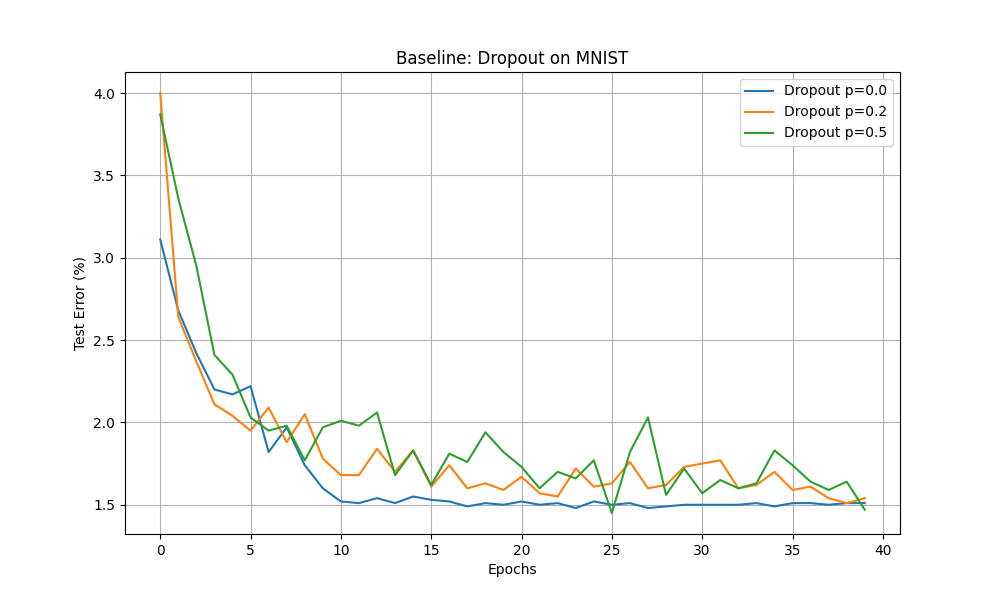
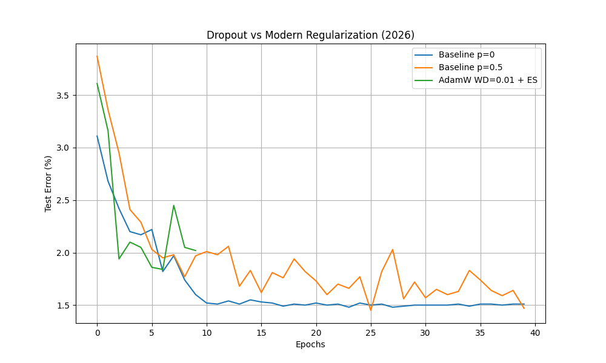

# Prevent Neural Networks from Overfitting: Dropout vs Modern Methods

An empirical reproduction and extension of the classic paper: **[Dropout: A Simple Way to Prevent Neural Networks from Overfitting — Srivastava et al. (2014)](https://jmlr.org/papers/v15/srivastava14a.html)**.

This repository not only reproduces the original results (Table 2 — MNIST MLP), but also introduces a **"Wow Angle"**: an empirical study on whether Dropout is still strictly necessary in 2026 when combined with modern, well-tuned regularization techniques like AdamW (Weight Decay) and Early Stopping.

---

## Project Goals
1. **Baseline Reproduction**: Replicate the effect of Dropout ($p=0, 0.2, 0.5$) on a standard Multilayer Perceptron (MLP) trained on the MNIST dataset, demonstrating how it mitigates overfitting.
2. **Modern Perspective (2026)**: Challenge the necessity of Dropout by replacing it with a combination of L2 Regularization (Weight Decay via `AdamW`) and Early Stopping.

## Architecture
The network follows the architecture referenced in the original paper for the MNIST dataset:
- **Input**: 784 (28x28 flattened image)
- **Hidden Layer 1**: 1024 units + ReLU + Dropout
- **Hidden Layer 2**: 1024 units + ReLU + Dropout
- **Output Layer**: 10 units

## How to Run

### 1. Setup Environment
```bash
python3 -m venv venv
source venv/bin/activate
pip install -r requirements.txt
```

### 2. Run Experiments
Execute the main script to run both the baseline reproduction and the modern techniques exploration:
```bash
python src/experiments.py
```

---

## Results

The experiments generate learning curves comparing the Test Error across epochs. 

### Phase 1: Classic Dropout (2014)
The baseline experiment confirms the original paper's findings. A network without dropout quickly begins to overfit, while $p=0.5$ stabilizes the learning curve and achieves a lower final test error.



### Phase 2: Dropout vs Modern Regularization (2026)
We replaced Dropout with optimal Weight Decay (via AdamW) and Early Stopping. The results show that carefully tuned modern regularization can achieve performance highly competitive with, or even surpassing, the classic Dropout mechanism, questioning its absolute necessity in modern architectures.



---
*Created as part of the "Introduction to Neural Networks" coursework.*